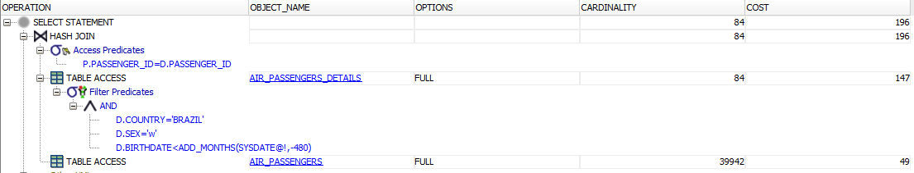
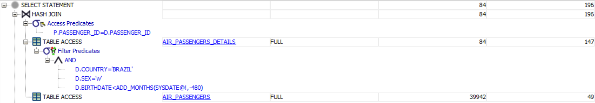
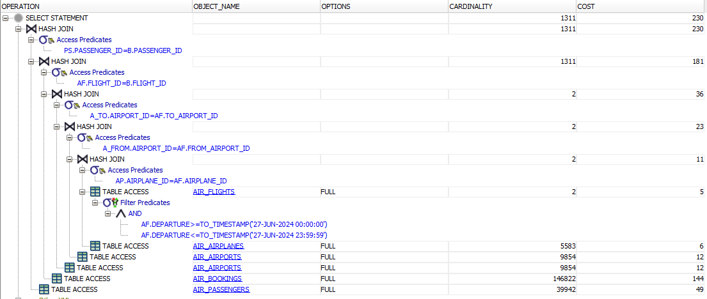
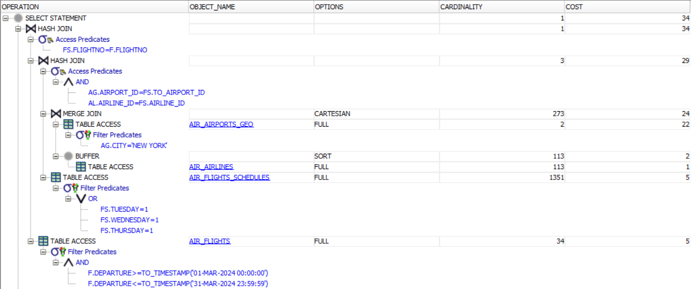
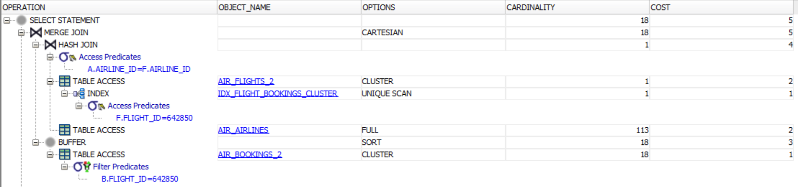
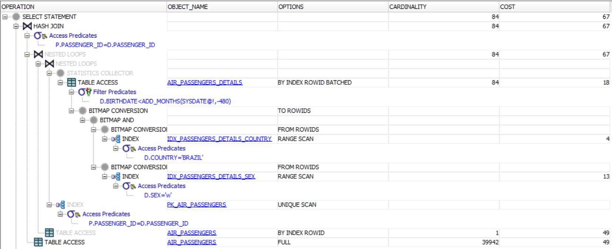
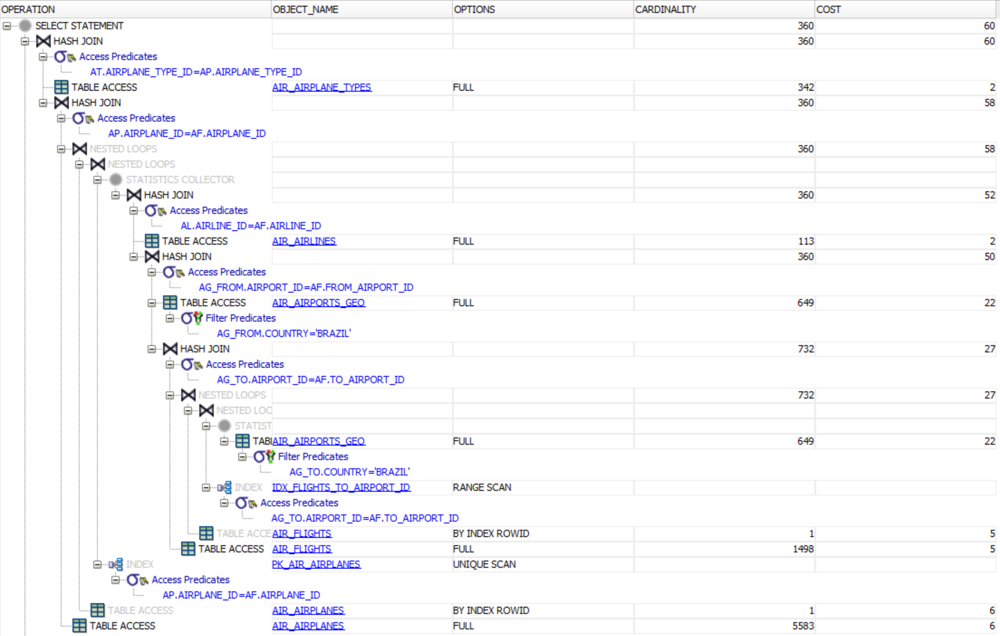
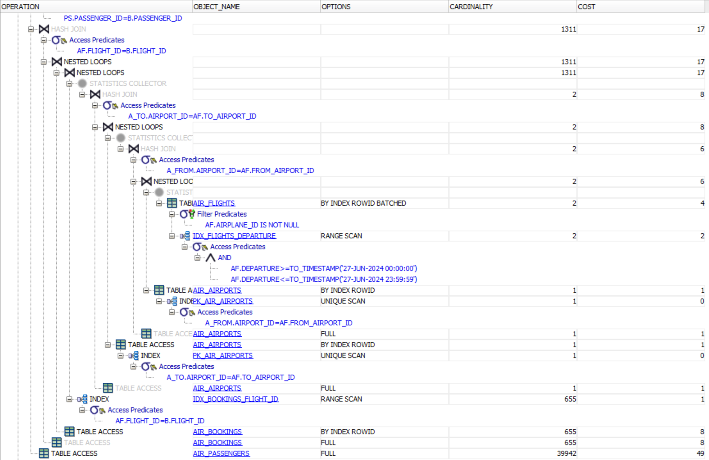
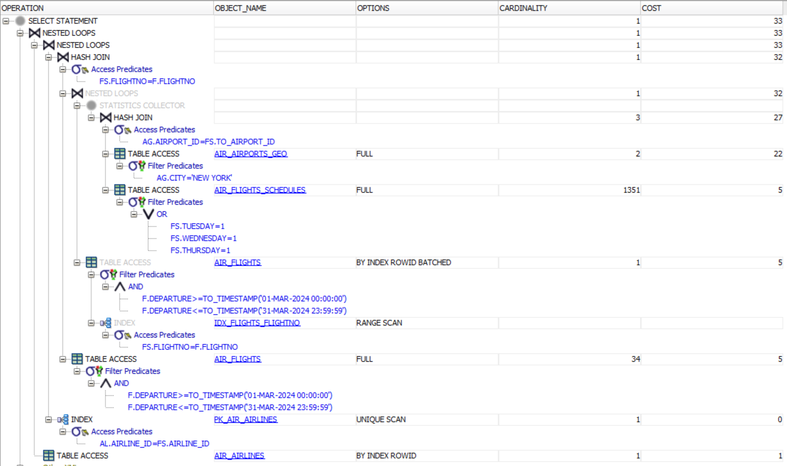
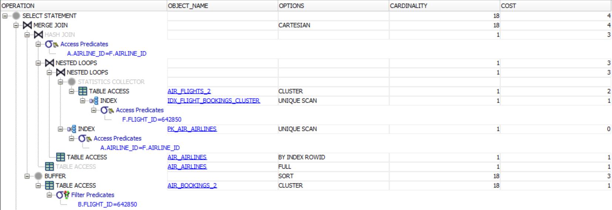

> Versão Markdown
> https://github.com/mbdavid/Arruda_T1/blob/main/Trabalho1-Mauricio.md

# Infraestrutura para Gestão de Dados

### Maurício David

> Trabalho 1 - 25/09/2024

## Etapa 2

1. Listar o nome completo (primeiro nome + último nome), a idade e a cidade de todos os passageiros do sexo feminino (sex='w') com mais de 40 anos, residentes no país 'BRAZIL'. [resposta sugerida = 141 linhas]

```sql
SELECT p.firstname || ' ' || p.lastname                 AS nome_completo,
       TRUNC(MONTHS_BETWEEN(SYSDATE, d.birthdate) / 12) AS idade,
       d.city                                           AS cidade
  FROM air_passengers p
 INNER JOIN air_passengers_details d
         ON p.passenger_id = d.passenger_id
 WHERE d.sex = 'w'
   AND d.birthdate < ADD_MONTHS(SYSDATE, - (12 * 40))
   AND d.country = 'BRAZIL'
```

2. Listar o nome da companhia aérea, o identificador da aeronave, o nome do tipo de aeronave e o número de todos os voos operados por essa companhia aérea (independentemente de a aeronave ser de sua propriedade) que saem E chegam em aeroportos localizados no país 'BRAZIL'. [resposta sugerida = 8 linhas]

```sql
SELECT al.airline_name AS nome_companhia,
       ap.airplane_id  AS identificador_aeronave,
       at.name         AS tipo_aeronave,
       af.flightno     AS nro_voo
  FROM air_flights af
 INNER JOIN air_airplanes ap         ON ap.airplane_id = af.airplane_id
 INNER JOIN air_airplane_types at    ON at.airplane_type_id = ap.airplane_type_id
 INNER JOIN air_airlines al          ON al.airline_id = af.airline_id
 INNER JOIN air_airports_geo ag_from ON ag_from.airport_id = af.from_airport_id
 INNER JOIN air_airports_geo ag_to   ON ag_to.airport_id = af.to_airport_id
 WHERE ag_from.country = 'BRAZIL'
   AND ag_to.country   = 'BRAZIL'
```

3. Listar o número do voo, o nome do aeroporto de saída e o nome do aeroporto de destino, o nome completo (primeiro e último nome) e o assento de cada passageiro, para todos os voos que partem no dia do seu aniversário (do seu mesmo, caro aluno, e não o do passageiro) neste ano (caso a consulta não retorne nenhuma linha, faça para o dia subsequente até encontrar uma data que retorne alguma linha). [resposta sugerida = 106 linhas para o dia 25/03/2024]

```sql
SELECT a_from.name                        AS aeroporto_saida,
       a_to.name                          AS aeroporto_destino,
       ps.firstname || ' ' || ps.lastname AS nome_completo,
       b.seat                             AS assento,
       af.flightno                        AS nro_voo
  FROM air_flights af
 INNER JOIN air_airplanes ap    ON ap.airplane_id = af.airplane_id
 INNER JOIN air_airports a_from ON a_from.airport_id = af.from_airport_id
 INNER JOIN air_airports a_to   ON a_to.airport_id = af.to_airport_id
 INNER JOIN air_bookings b      ON af.flight_id = b.flight_id
 INNER JOIN air_passengers ps   ON ps.PASSENGER_id = b.PASSENGER_id
 WHERE af.DEPARTURE BETWEEN '27-JUN-2024 00:00:00' AND '27-JUN-2024 23:59:59'
```

4. Listar o nome da companhia aérea bem como a data e a hora de saída de todos os voos que chegam para a cidade de 'NEW YORK' que partem às terças, quartas ou quintas-feiras, no mês do seu aniversário (caso a consulta não retorne nenhuma linha, faça para o mês subsequente até encontrar um mês que retorne alguma linha). [resposta sugerida = 1 linha para o mês de março de 2024]

```sql
SELECT al.airline_name                      AS nome_companhia,
       TO_CHAR(f.departure, 'DD/MM/YYYY')   AS data_saida,
       TO_CHAR(f.departure, 'HH24:MI')      AS hora_saida,
       TO_CHAR(f.arrival, 'DD/MM/YYYY')     AS data_chegada,
       TO_CHAR(f.arrival, 'HH24:MI')        AS hora_chegada
  FROM air_flights f
 INNER JOIN air_flights_schedules fs ON fs.flightno = f.flightno
 INNER JOIN air_airlines al ON al.airline_id = fs.airline_id
 INNER JOIN air_airports_geo ag ON ag.airport_id = fs.to_airport_id
 WHERE ag.city = 'NEW YORK'
   AND f.departure BETWEEN '01-MAR-2024 00:00:00' AND '31-MAR-2024 23:59:59'
   AND (fs.tuesday = 1 OR fs.wednesday = 1 OR fs.thursday = 1)
```

> _Nenhum outro mês de 2024 tinha dados._

5. Crie uma consulta que seja resolvida adequadamente com um acesso hash em um cluster com pelo menos duas tabelas. A consulta deve utilizar todas as tabelas do cluster e pelo menos outra tabela fora dele.

```sql
-- Cria cluster entre Flights e Bookings
CREATE CLUSTER air_flight_bookings_cluster (flight_id NUMBER(10,0)) SIZE 8192;

-- Cria indice para o cluster
CREATE INDEX idx_flight_bookings_cluster ON CLUSTER air_flight_bookings_cluster;

-- Novas tabelas com cluster
CREATE TABLE air_flights_2
(
  flight_id       NUMBER(10,0),
  flightno        CHAR(8),
  airline_id      NUMBER(5,0),
  from_airport_id NUMBER(5,0),
  to_airport_id   NUMBER(5,0),
  airplane_id     NUMBER(5,0),
  departure       TIMESTAMP(6),
  arrival         TIMESTAMP(6)
)
CLUSTER air_flight_bookings_cluster (flight_id);

CREATE TABLE air_bookings_2
(
  booking_id   NUMBER(20,0),
  flight_id    NUMBER(10,0),
  passenger_id NUMBER(12,0),
  seat         CHAR(4),
  price        NUMBER(10,2)
)
CLUSTER air_flight_bookings_cluster (flight_id);

-- Populando tabela com os registros
INSERT INTO air_flights_2  (SELECT * FROM air_flights);
INSERT INTO air_bookings_2 (SELECT * FROM air_bookings);

-- Consulta usando indice do cluster
SELECT a.airline_name AS nome_companhia,
       f.flightno     AS nro_voo,
       b.seat         AS nro_assento,
       b.price        AS valor_passagem
  FROM air_flights_2 f
 INNER JOIN air_bookings_2 b ON f.flight_id = b.flight_id
 INNER JOIN air_airlines a ON a.airline_id = f.airline_id
 WHERE f.flight_id = 642850;
```

## Etapa 3

#### Plano de Execução Query 1



#### Plano de Execução Query 2



#### Plano de Execução Query 3



#### Plano de Execução Query 4



#### Plano de Execução Query 5



## Etapa 4

Os seguintes scripts foram criados para as PK, FK e indices B-TREE para consultas:

```sql
-- Chaves primárias
ALTER TABLE AIR_AIRLINES ADD CONSTRAINT PK_AIR_AIRLINES PRIMARY KEY (AIRLINE_ID);
ALTER TABLE AIR_AIRPLANE_TYPES ADD CONSTRAINT PK_AIR_AIRPLANE_TYPES PRIMARY KEY (AIRPLANE_TYPE_ID);
ALTER TABLE AIR_AIRPLANES ADD CONSTRAINT PK_AIR_AIRPLANES PRIMARY KEY (AIRPLANE_ID);
ALTER TABLE AIR_AIRPORTS ADD CONSTRAINT PK_AIR_AIRPORTS PRIMARY KEY (AIRPORT_ID);
ALTER TABLE AIR_AIRPORTS_GEO ADD CONSTRAINT PK_AIR_AIRPORTS_GEO PRIMARY KEY (AIRPORT_ID);
ALTER TABLE AIR_BOOKINGS ADD CONSTRAINT PK_AIR_BOOKINGS PRIMARY KEY (BOOKING_ID);
ALTER TABLE AIR_FLIGHTS ADD CONSTRAINT PK_AIR_FLIGHTS PRIMARY KEY (FLIGHT_ID);
ALTER TABLE AIR_PASSENGERS ADD CONSTRAINT PK_AIR_PASSENGERS PRIMARY KEY (PASSENGER_ID);
ALTER TABLE AIR_PASSENGERS_DETAILS ADD CONSTRAINT PK_AIR_PASSENGERS_DETAILS PRIMARY KEY (PASSENGER_ID);


-- Chaves estrangeiras
ALTER TABLE AIR_AIRPLANES ADD CONSTRAINT FK_AIR_AIRPLANES_AIRLINE_ID FOREIGN KEY (AIRLINE_ID) REFERENCES AIR_AIRLINES(AIRLINE_ID);
ALTER TABLE AIR_AIRPLANES ADD CONSTRAINT FK_AIR_AIRPLANES_TYPE FOREIGN KEY (AIRPLANE_TYPE_ID) REFERENCES AIR_AIRPLANE_TYPES(AIRPLANE_TYPE_ID);

ALTER TABLE AIR_FLIGHTS ADD CONSTRAINT FK_AIR_FLIGHTS_AIRLINE_ID FOREIGN KEY (AIRLINE_ID) REFERENCES AIR_AIRLINES(AIRLINE_ID);
ALTER TABLE AIR_FLIGHTS ADD CONSTRAINT FK_AIR_FLIGHTS_AIRPLANE_ID FOREIGN KEY (AIRPLANE_ID) REFERENCES AIR_AIRPLANES(AIRPLANE_ID);
ALTER TABLE AIR_FLIGHTS ADD CONSTRAINT FK_AIR_FLIGHTS_FROM_AIRPORT_ID FOREIGN KEY (FROM_AIRPORT_ID) REFERENCES AIR_AIRPORTS(AIRPORT_ID);
ALTER TABLE AIR_FLIGHTS ADD CONSTRAINT FK_AIR_FLIGHTS_TO_AIRPORT_ID FOREIGN KEY (TO_AIRPORT_ID) REFERENCES AIR_AIRPORTS(AIRPORT_ID);

ALTER TABLE AIR_BOOKINGS ADD CONSTRAINT FK_AIR_BOOKINGS_FLIGHT_ID FOREIGN KEY (FLIGHT_ID) REFERENCES AIR_FLIGHTS(FLIGHT_ID);
ALTER TABLE AIR_BOOKINGS ADD CONSTRAINT FK_AIR_BOOKINGS_PASSENGER_ID FOREIGN KEY (PASSENGER_ID) REFERENCES AIR_PASSENGERS(PASSENGER_ID);

ALTER TABLE AIR_PASSENGERS_DETAILS ADD CONSTRAINT FK_AIR_PASSENGERS_DETAILS_PASSENGER_ID FOREIGN KEY (PASSENGER_ID) REFERENCES AIR_PASSENGERS(PASSENGER_ID);

-- Índices para a Query 1
CREATE INDEX IDX_PASSENGERS_DETAILS_SEX ON AIR_PASSENGERS_DETAILS(SEX);
CREATE INDEX IDX_PASSENGERS_DETAILS_COUNTRY ON AIR_PASSENGERS_DETAILS(COUNTRY);
CREATE INDEX IDX_PASSENGERS_DETAILS_BIRTHDATE ON AIR_PASSENGERS_DETAILS(BIRTHDATE);

-- Índices para a Query 2 e Query 4
CREATE INDEX IDX_FLIGHTS_FROM_AIRPORT_ID ON AIR_FLIGHTS(FROM_AIRPORT_ID);
CREATE INDEX IDX_FLIGHTS_TO_AIRPORT_ID ON AIR_FLIGHTS(TO_AIRPORT_ID);
CREATE INDEX IDX_FLIGHTS_DEPARTURE ON AIR_FLIGHTS(DEPARTURE);
CREATE INDEX IDX_FLIGHTS_ARRIVAL ON AIR_FLIGHTS(ARRIVAL);
CREATE INDEX IDX_FLIGHTS_FLIGHTNO ON AIR_FLIGHTS(FLIGHTNO);

-- Índices para a Query 3
CREATE INDEX IDX_BOOKINGS_FLIGHT_ID ON AIR_BOOKINGS(FLIGHT_ID);
CREATE INDEX IDX_BOOKINGS_PASSENGER_ID ON AIR_BOOKINGS(PASSENGER_ID);

-- Índices para a Query 4
CREATE INDEX IDX_FLIGHTS_SCHEDULES_FLIGHTNO ON AIR_FLIGHTS_SCHEDULES(FLIGHTNO);
CREATE INDEX IDX_FLIGHTS_SCHEDULES_TUESDAY_WEDNESDAY_THURSDAY ON AIR_FLIGHTS_SCHEDULES(TUESDAY, WEDNESDAY, THURSDAY);

-- Índices para a Query 5
CREATE INDEX IDX_BOOKINGS_SEAT ON AIR_BOOKINGS(SEAT);
CREATE INDEX IDX_BOOKINGS_PRICE ON AIR_BOOKINGS(PRICE);
```

### Resultado do Tunning

---

#### Plano de Execução Query 1



#### Plano de Execução Query 2



#### Plano de Execução Query 3



#### Plano de Execução Query 4



#### Plano de Execução Query 5


